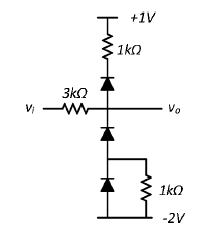

# Electronics

This repository contains materials and assignments for the course Electronics. The course covers fundamental concepts including Op-Amps, Semiconductors, Diodes, Bipolar Junction Transistors, MOSFETs, and Analog Integrated Circuit Building Blocks.

## Course Outline:

1. Op-Amp review, Semiconductors, charge transport, pn junction 
2. Diodes and diode circuits 
3. Device physics of the Bipolar Junction Transistor 
4. Bipolar transistor biasing and small signal analysis and BJT amplifiers 
5. Device physics of the MOS Field Effect Transistors 
6. MOSFET biasing, small signal analysis and MOS Amplifiers 
7. Analog Integrated Circuit Building Blocks 

For assignments, PSpice Circuit simulator is used.

## Assignments

### Assignment 1

This assignment deals with the simulation of diodes. It requires the calculation of the saturation current and definition of the diode model in PSpice. Transient simulations are conducted with sine, square, and triangle wave inputs. The circuits, .asc files, and simulation plots can be found in the respective folders:

- [Simulation plots](Assignment1_simulations.pdf)
- [Circuit schematics](./circuits_assignment1/)

### Assignment 2

The second assignment revolves around the SPICE simulation of an amplifier configuration. The influence of a bypass capacitor on the voltage at different points of the circuit is examined. The resistance of the load is also changed to observe its effect on voltage gain. Related plots and circuit schematics are provided in the respective folders:

- [Simulation plots](Assignment2_simulations.pdf)
- [Circuit schematics](./circuits_assignment2/)

### Assignment 3

The third assignment involves the use of MOSFETs. The operation points are observed through .op simulation in PSpice. The signal voltage at different terminals is calculated and verified with simulations. The assignment also requires the calculation of voltage gain and examination of signal source amplitude. The details, .asc files, and simulation plots can be found in the respective folders:

- [Simulation plots](Assignment3_simulations.pdf)
- [Circuit schematics](./circuits_assignment3/)